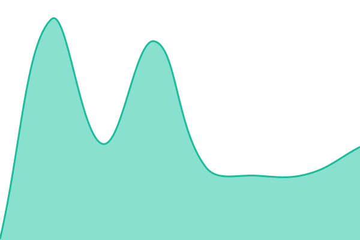

# [📈 Live Status](https://upptime.ragetech.xyz): <!--live status--> **🟥 Complete outage**

This repository contains the open-source uptime monitor and status page for [Chad Cantrell](MmmYeah.Com), powered by [Upptime](https://github.com/upptime/upptime).

With [Upptime](https://upptime.js.org), you can get your own unlimited and free uptime monitor and status page, powered entirely by a GitHub repository. We use [Issues](https://github.com/ragecc/upptime/issues) as incident reports, [Actions](https://github.com/ragecc/upptime/actions) as uptime monitors, and [Pages](https://upptime.ragetech.xyz) for the status page.

<!--start: status pages-->
<!-- This summary is generated by Upptime (https://github.com/upptime/upptime) -->
<!-- Do not edit this manually, your changes will be overwritten -->
<!-- prettier-ignore -->
| URL | Status | History | Response Time | Uptime |
| --- | ------ | ------- | ------------- | ------ |
|  [RageTech.Xyz](https://ragetech.xyz) | 🟥 Down | [rage-tech-xyz.yml](https://github.com/ragecc/upptime/commits/HEAD/history/rage-tech-xyz.yml) | 

 134ms
     
 | 

<a href="https://upptime.ragetech.xyz/history/rage-tech-xyz">0.00%</a>
    

|  [MmmYeah.Com](https://mmmyeah.com) | 🟥 Down | [mmm-yeah-com.yml](https://github.com/ragecc/upptime/commits/HEAD/history/mmm-yeah-com.yml) | 

 122ms
     
 | 

<a href="https://upptime.ragetech.xyz/history/mmm-yeah-com">0.00%</a>
    

<!--end: status pages-->

[**Visit our status website →**](https://upptime.ragetech.xyz)

## 📄 License

- Powered by: [Upptime](https://github.com/upptime/upptime)
- Code: [MIT](./LICENSE) © [Chad Cantrell](MmmYeah.Com)
- Data in the `./history` directory: [Open Database License](https://opendatacommons.org/licenses/odbl/1-0/)
